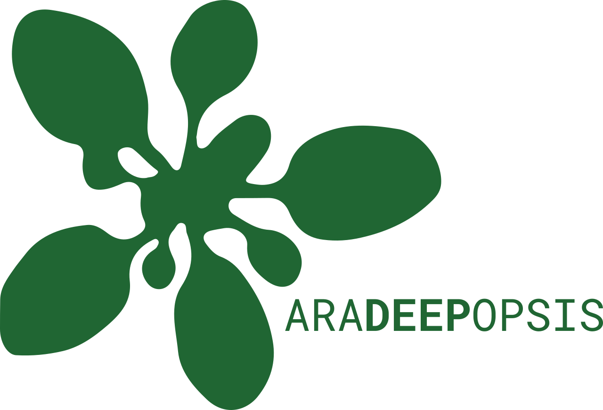

# 


[](https://hub.docker.com/r/beckerlab/aradeepopsis/)
[](https://www.nextflow.io/)
[](https://conda.io/)

# Introduction

araDeepopsis is a software tool that enables plant researchers to non-invasively score plant growth, biomass accumulation and senescence from image data in a highly parallelized, high throughput, yet easy to use manner.

It is built upon the published, convolutional neural network (CNN) [DeepLabv3+](https://github.com/tensorflow/models/tree/master/research/deeplab)<sup>[[1]](#ref1)</sup> that serves the task of semantic image segmentation. A [pretrained checkpoint](http://download.tensorflow.org/models/deeplabv3_xception_2018_01_04.tar.gz) of this model has been trained upon using manually annotated top-view images of *Arabidopsis thaliana* plants of different ages.
The code that was used for training as well as download links for the training datasets can be found [here](https://github.com/phue/models/tree/aradeepopsis_manuscript/research/deeplab).

# How it works


The pipeline is implemented using open source software such as [`Nextflow`](https://www.nextflow.io/)<sup>[[2]](#ref2)</sup>, [`TensorFlow`](https://www.tensorflow.org/)<sup>[[3]](#ref3)</sup>, [`ImageMagick`](https://imagemagick.org), [`scikit-image`](https://scikit-image.org/)<sup>[[4]](#ref4)</sup> and [`shiny`](https://shiny.rstudio.com/)<sup>[[5]](#ref5)</sup>.

The pipeline uses either a [conda environment](https://conda.io/en/latest/) or a [Docker container](https://www.docker.com/resources/what-container) to resolve dependencies, ensuring a high level of reproducibility and portability. It is largely platform independent and scales from Personal Computers to High Performance Computing (HPC) infrastructure, allowing for time efficient analysis of hundreds of thousands of images within a day.

> Note: To ensure reproducibility, it is recommended to use the provided [container image](https://hub.docker.com/r/beckerlab/aradeepopsis/).

Once the pipeline is fed with images of single plants, it converts the images into chunks of arbitrary size by saving the image data into an [IO-optimized binary file format](https://www.tensorflow.org/tutorials/load_data/tfrecord).

These file records are then, in parallel, served to a deep learning model, allowing for pixel-by-pixel classification of the image data.

Three distinct [models](docs/parameters.md#--model) are available and should be chosen according to the research interest.


Depending on the model of choice, the pipeline extracts relevant phenotypic information such as:

* plant area (`model A/B/C`)
* area of senescent/necrotic tissue (`model B/C`)
* area of anthocyanin-rich tissue (`model C`)
* color composition and color indices as described by [Del Valle et al. 2018](https://doi.org/10.1002/ece3.3804)<sup>[[6]](#ref6)</sup> for each class supported by the respective model
* a variety of morphometric traits for each class supported by the respective model


# Usage

## Setting up the pipeline

> Note: Windows users will have to set up the [WSL](https://docs.microsoft.com/en-us/windows/wsl/install-win10) first.

1. Install [`Nextflow`](https://www.nextflow.io/index.html#GetStarted)

2. Install either [`conda`](https://docs.conda.io/projects/conda/en/latest/user-guide/install/), [`Docker`](https://docs.docker.com/install/), [`podman`](https://podman.io/getting-started/installation) or [`Singularity`](https://sylabs.io/guides/3.0/user-guide/installation.html)

> Note: To run the pipeline on MacOS with Docker, it is necessary to increase the allowed memory usage from the default setting of 2GB to 6GB (See the [Docker documentation](https://docs.docker.com/docker-for-mac/#resources) for instructions)

## Running the pipeline

To run the pipeline you have to provide single-pot plant images:

```bash
nextflow run Gregor-Mendel-Institute/aradeepopsis --images 'path/to/images/*{png|jpg}' -profile {conda|docker|podman|singularity}
```

### Example to run on the CBE cluster using Singularity

```bash
module load singularity/3.4.1
module load nextflow/19.10.0

nextflow run Gregor-Mendel-Institute/aradeepopsis --images 'path/to/images/*{png|jpg}' -profile cbe,singularity
```

## Default [Parameters](docs/parameters.md)

| Parameter | Default value | Type |
| ------------- | ------------- | ------------- |
| [`--model`](docs/parameters.md#--model)  | `C` | `<Character>` |
| [`--images`](docs/parameters.md#--images) | `None` | `<Path>` |
| [`--multiscale`](docs/parameters.md#--multiscale)| `false` | `<Boolean>` |
| [`--chunksize`](docs/parameters.md#--chunksize) | `10` | `<Integer>` |
| [`--ignore_senescence`](docs/parameters.md#--ignore_senescence) | `true` | `<Boolean>` |
| [`--outdir`](docs/parameters.md#--outdir) | `./results`  | `<Path>` |
| [`--save_overlay`](docs/parameters.md#--save_overlay) | `true` | `<Boolean>` |
| [`--save_mask`](docs/parameters.md#--save_mask)| `true` | `<Boolean>` |
| [`--save_hull`](docs/parameters.md#--save_hull) | `true` | `<Boolean>` |
| [`--summary_diagnostics`](docs/parameters.md#--summary_diagnostics) | `false` | `<Boolean>` |
| [`--shiny`](docs/parameters.md#--shiny) | `true` | `<Boolean>` |

## Pipeline [Output](docs/output.md)

The pipeline computes a total of 78 morphometric and color-related traits from the analysed images.
A description of all traits is available [here](docs/output.md#Trait-table).

# References

> <a name="ref1">[1]</a> **Encoder-Decoder with Atrous Separable Convolution for Semantic Image Segmentation.**<br />Chen, L.-C. et al., 2018. arXiv [cs.CV]. Available at: http://arxiv.org/abs/1802.02611.

> <a name="ref2">[2]</a> **Nextflow enables reproducible computational workflows.**<br />Di Tommaso, P. et al., 2017. Nature biotechnology, 35(4), pp.316–319.

> <a name="ref3">[3]</a> **TensorFlow: Large-scale machine learning on heterogeneous systems.**<br />Martín Abadi, Ashish Agarwal, Paul Barham, Eugene Brevdo, Zhifeng Chen, Craig Citro, Greg S. Corrado, Andy Davis, Jeffrey Dean, Matthieu Devin, Sanjay Ghemawat, Ian Goodfellow, Andrew Harp, Geoffrey Irving, Michael Isard, Rafal Jozefowicz, Yangqing Jia,Lukasz Kaiser, Manjunath Kudlur, Josh Levenberg, Dan Mané, Mike Schuster, Rajat Monga, Sherry Moore, Derek Murray, Chris Olah, Jonathon Shlens, Benoit Steiner, Ilya Sutskever, Kunal Talwar, Paul Tucker, Vincent Vanhoucke, Vijay Vasudevan, Fernanda Viégas, Oriol Vinyals, Pete Warden, Martin Wattenberg, Martin Wicke, Yuan Yu, and Xiaoqiang Zheng, 2015

> <a name="ref4">[4]</a> **scikit-image: Image processing in Python.**<br />Stéfan van der Walt, Johannes L. Schönberger, Juan Nunez-Iglesias, François Boulogne, Joshua D. Warner, Neil Yager, Emmanuelle Gouillart, Tony Yu and the scikit-image contributors. PeerJ 2:e453 (2014)

> <a name="ref5">[5]</a> **shiny: Easy web applications in R**<br />Rstudio Inc. (2014)

> <a name="ref6">[6]</a> **Digital photography provides a fast, reliable, and noninvasive method to estimate anthocyanin pigment concentration in reproductive and vegetative plant tissues**<br />Del Valle JC, Gallardo-López A, Buide ML, Whittall JB, Narbona E, 2018. Ecol Evol. 8(6):3064–76.